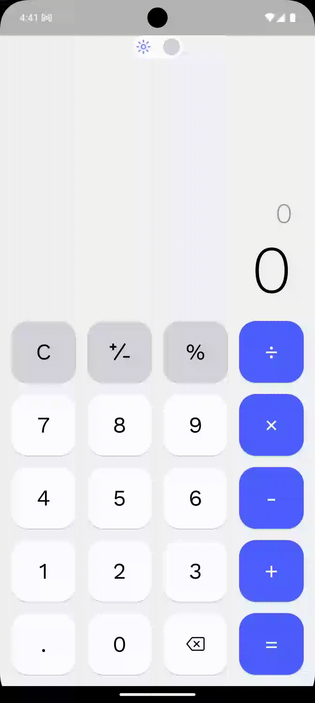
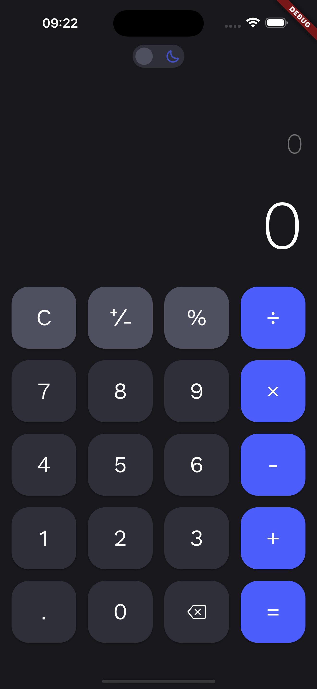
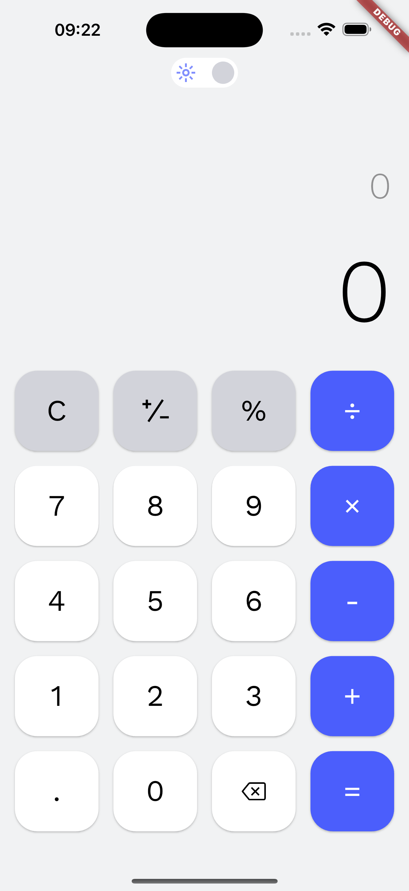

# Caculator App

This is the Sample Calcular App using Provider to manager states

## How to get started on the project

Type this command in the terminal to start

```sh
  flutter pub get
  flutter run
```

## App Running

While running app

<p align="center">
  
</p>
ScreenShot of app

<p align="center">
  
  
</p>

### Project Structure

```
$PROJECT_ROOT
├── lib                  # Main application code
│   ├── common           # Reusable UI components (widgets)
│   ├── configs          # Folder stores static variables (e.g., color of buttons)
│   ├── manager          # Folder for managing information (e.g., user's settings)
│   ├── models           # Models And Enum
│   ├── theme            # Folder for custom app theme
│   └── views            # Folder for views
├── assets               # Static resources (images, gifs, etc.)
└── pubspec.yaml         # Flutter project configuration file
```
